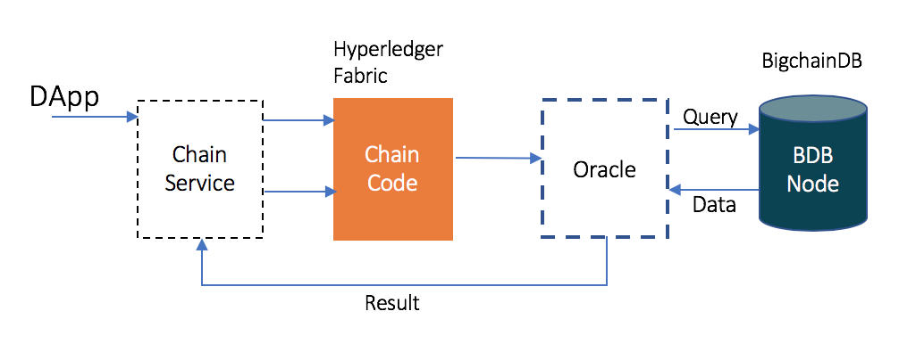

# BigchainDB - Hyperledger Fabric Integration

## Problem Statement

How to use BigchainDB data in Hyperledger chaincode? What can be integration patterns to make this happen?

## Solution

The following diagram depicts the high-level architecture of the solution.

## Components

1. DApp Frontend
1. Chain Service - connects frontend to Hyperledger Fabric chaincode
1. Hyperledger Fabric running chaincode
1. Oracle - connects Hyperledger Fabric chaincode to BigchainDB
1. BigchainDB - has the data

## Workflow

The approach is based on and similar to how Oraclize works for Ethereum. Following are the steps involved,

1. DApp calls the chain service with the asset id of the BigchainDB asset to be processed by Hyperledger chaincode.
1. Hyperledger Fabric chaincode is called by chain service. This chain code has the built in functionality to call a REST API from one of its functions.
1. The chain code runs the logic in it and calls the REST API on the oracle component.
1. The oracle is a REST API based service which sits between Hyperledger Fabric and BigchainDB.
1. The chain code call the oracle service with 2 parameters,
    1. the query to run on BigchainDB (asset id)
    1. the code to run after the query (as a callback)
1. The oracle service calls BigchainDB API for the query
1. Once the data is returned by BigchainDB, the oracle runs the callback with asset data as input.
1. After callback execution, the oracle posts the result to chain service.
1. The chain service sends the result to Hyperledger Fabric chaincode for storage or further processing.

This way the Hyperledger Fabric chaincode does not have to depend and wait for the query to complete on BigchainDB. The entire logic runs in a deterministic way.
